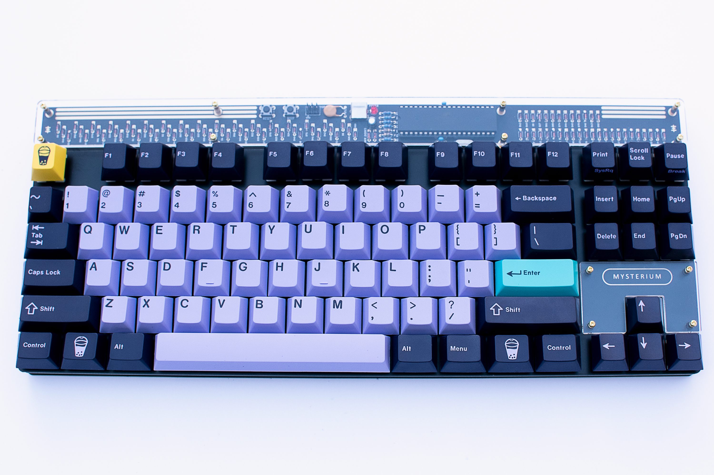
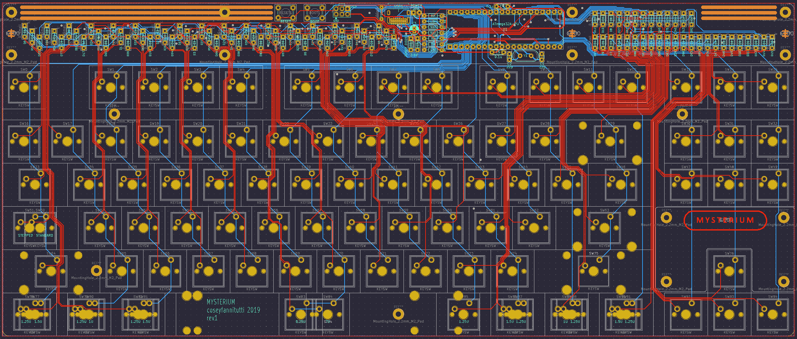
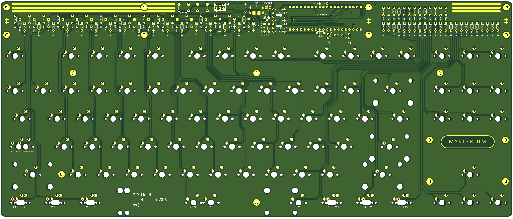
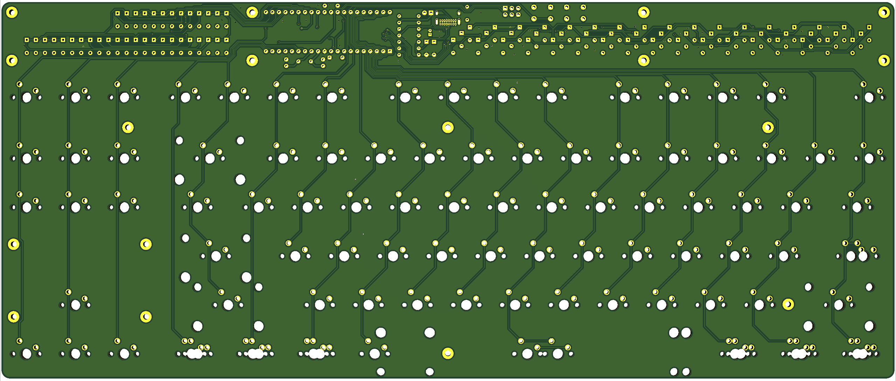
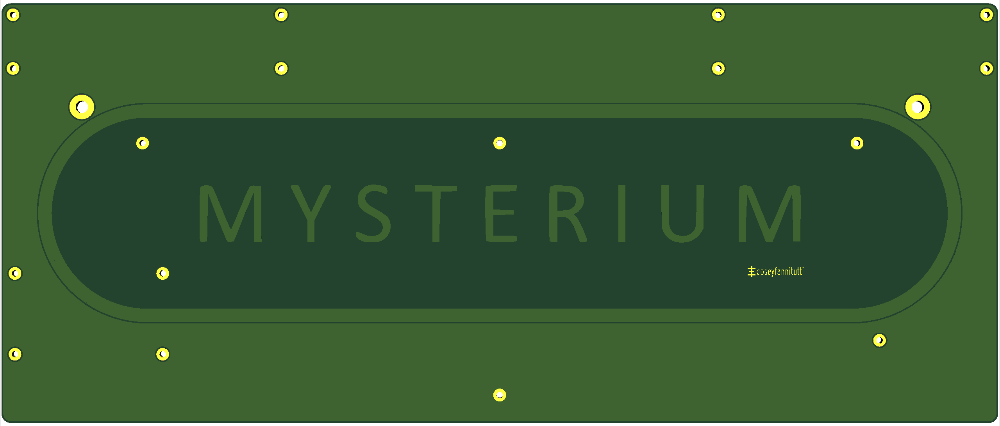

# MYSTERIUM
**TKL keyboard that can be entirely assembled using only through hole components, including usb type c**

**[BOM, Build Guide, and Flashing Information](./doc)**

**Kits available at [cftkb.com](https://www.cftkb.com)**

**[Optional High Profile Lasercut Acrylic Case](./case)**

