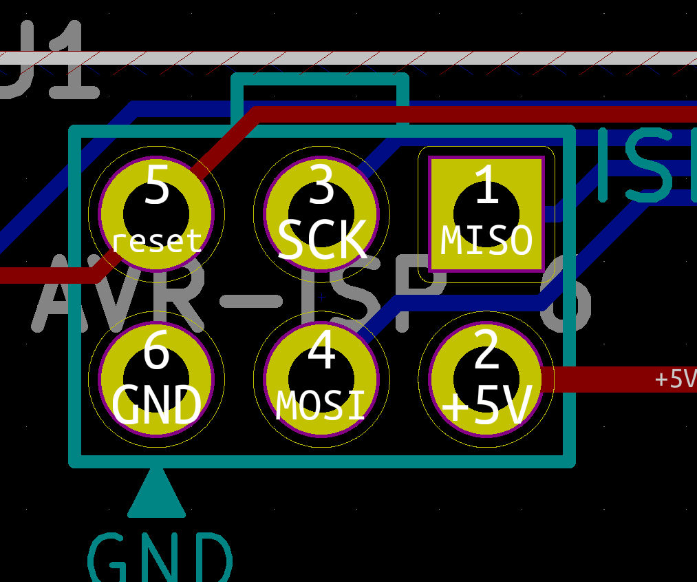
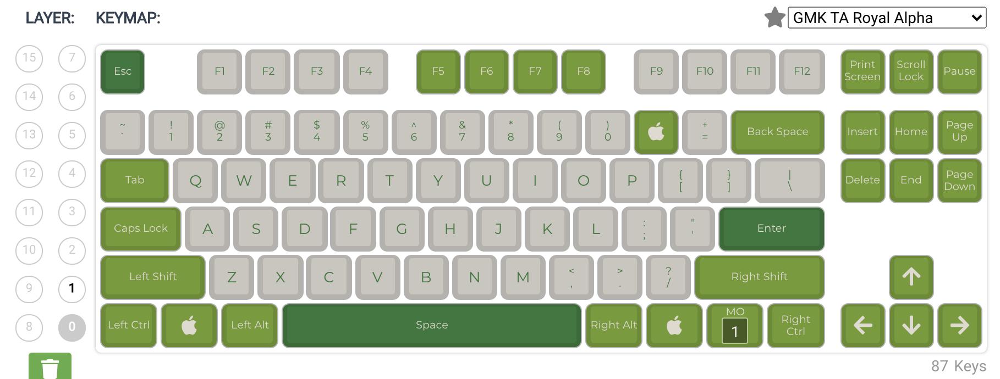
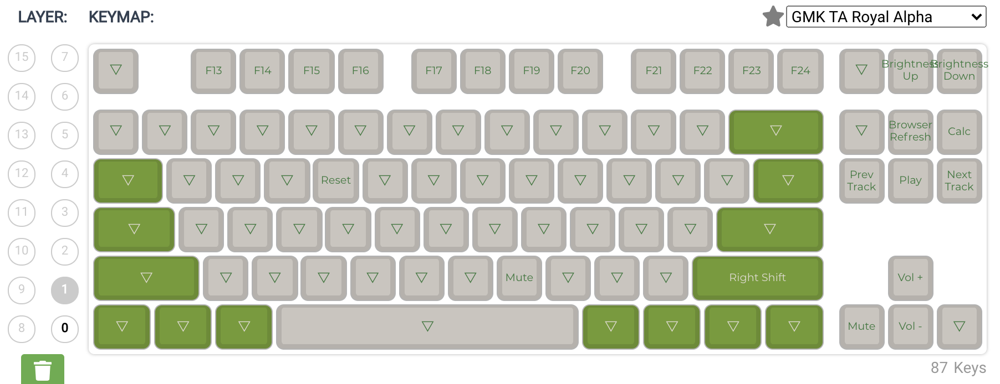

# Bootloader

## If you buy a kit from cftkb.com your microcontroller already has the bootloader flashed and you do not need this.

This project uses USBaspLoader as the usb bootloader on the atmega32a.
- My custom bootloader:   
https://github.com/coseyfannitutti/USBaspLoader/tree/atmega32a
  - Please ensure you are in the atmega32a branch of my fork of the USBaspLoader repository when downloading.
  - Follow the directions in the readme for directions on setting up the build environment for your operating system as well as flash instructions.
  - Makefile.inc sets flashing device as usbtiny, as I use a sparkfun pocket avr programmer. If you need to use another programmer please edit line 41 of Makefile.inc accordingly. Only edit Makefile.inc, and NEVER directly edit the actual Makefile.
  - Commands for flashing once build environment is set up:
  
	```make flash``` (flashes makefile)
  
  	```make fuse``` (sets fuses for microcontroller)
  
## Enter bootloader mode
1. Press and hold ```BOOT``` switch
2. Tap ```RESET``` switch
3. Release ```BOOT``` switch

Alternatively, you can hold ```BOOT``` switch while inserting the USB cable.

If you have successfully entered bootloader mode you should see USBaspLoader in device manager or as a connected device in QMK Toolbox.

## Flashing example bootloader files

This is for people who are new to AVR microprocessors and just want to use a basic keyboard configuration

1. Install Avrdude 
   * Guide for [Windows](http://ladyada.net/learn/avr/setup-win.html), [MacOS](https://www.ladyada.net/learn/avr/setup-mac.html)
   * Linux: ```sudo apt-get install gcc-avr binutils-avr avr-libc gdb-avr avrdude```

2. Upload the ArduinoISP exmaple sketch to an arduino

3. Connect the Arduino to the ISP header of the keyboard with the pinouts from [here](https://www.arduino.cc/en/pmwiki.php?n=Tutorial/ArduinoISP)

   * The keyboard's header has this pinout 
   

4. Connect the Arduino to your computer via USB

5. Download ```bootloader_exampe.hex``` and ```mysterium_example.hex```

6. Run ```avrdude -c avrisp -p m32 -b 19200 -U lfuse:w:0x1f:m -U hfuse:w:0xc0:m -U flash:w:/path/to/bootloader_example.hex:i -P (Arduino Port)```

   * Replace ```/path/to``` with the path to your hex file and ```(Arduino Port)``` with the port that your Arduino is connected to

   * On Windows, (Arduino Port) looks like ```COM12```

   * On MacOS, (Arduino Port) looks like ```/dev/cu.usbmodem1421```

   * This flashes the bootloader and sets the fuses

7. Run ```avrdude -c avrisp -p m32 -b 19200 -U flash:w:/path/to/mysterium_example.hex:i -P (Arduino Port)```
    * This flashes the keyboard firmware

**Notes**
* ```mysterium_example.hex``` can be substituted with a layout from [QMK Configurator](https://config.qmk.fm/#/coseyfannitutti/mysterium/LAYOUT_tkl_ansi)

* The layout of ```mysterium_example.hex``` looks like this
   * Layer 0 (default) 
      
   * Layer 1 (active while holding the FN key)
      


